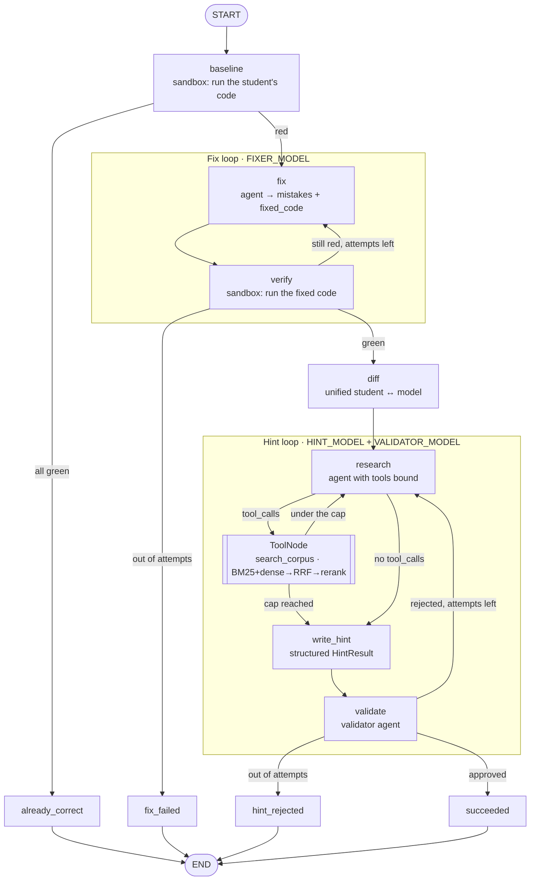
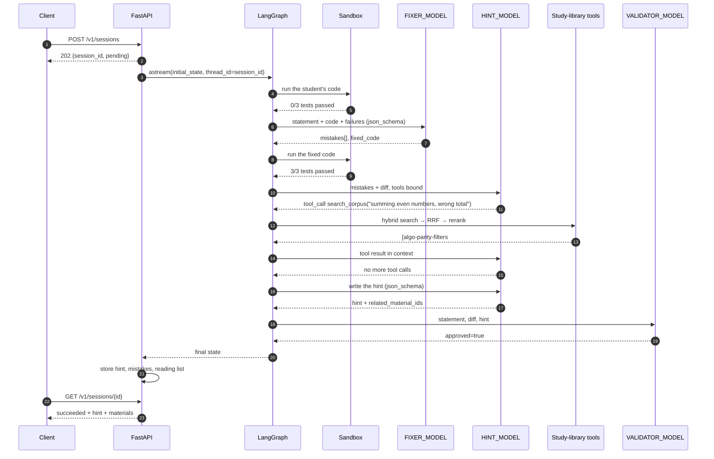

# problem-helper

An agent service: it takes a problem statement, a student's broken Python code and tests
(`stdin → stdout`), and returns a **hint** rather than a ready solution.

The repaired code and the diff stay inside the service — the agents need them so the hint
aims at the real mistake, and they are exposed only through the debug endpoint.

The pipeline is a **LangGraph** state machine driven by **LangChain** models and tools:
three agent roles (fixer, hint writer, validator) sit on the nodes, the hint writer can
search the study library on its own through a **hybrid RAG retriever** (BM25 + vectors →
RRF → cross-encoder), and every superstep is checkpointed, so a session that dies mid-flight
resumes instead of paying the provider twice.

The retrieval layer is measured, not asserted: [Retrieval and evaluation](#retrieval-and-evaluation)
carries the numbers, the failure categories they are broken down by, and the two places
where the retrieval table and the generation table disagree.

## Setup

```bash
cp .env.example .env      # put your LLM_API_KEY in
uv sync
uv run problem-helper     # http://127.0.0.1:8000
```

The first search downloads two ONNX models (~130 MB, `BAAI/bge-small-en-v1.5` and
`Xenova/ms-marco-MiniLM-L-6-v2`) into the `fastembed` cache; after that the retriever is
offline. The chunk embeddings are cached under `.rag_cache/`, keyed by a digest of the
corpus, so they are recomputed exactly when the corpus changes.

Any OpenAI-compatible provider works (`LLM_BASE_URL`, OpenRouter by default). The three
model roles are configured separately; the fixer and the validator should be models that
support **structured outputs** (`response_format=json_schema`), because that is the first
thing the client tries. A model that rejects it is not a problem — the schema moves into
the prompt and the choice is remembered for that model id — but a model that supports it
gives far fewer retries. The hint model additionally needs **tool calling**.

```bash
uv run pytest                   # 153 tests, the provider is replaced by a fake
uvx ruff check src tests evals  # ruff is not a project dependency
```

Smoke run against a real provider:

```bash
DB_PATH=/tmp/x.db PORT=8079 uv run problem-helper
# then POST /v1/sessions and poll GET /v1/sessions/{id}
```

## How it works

```
POST /v1/sessions ──► session row (pending) ──► asyncio task ──► LangGraph run
                                                                  │
                       1. run the student's code in the sandbox (baseline)
                          └─ everything green → outcome=already_correct, done
                       2. FIX LOOP (FIXER_MODEL), up to MAX_FIX_ATTEMPTS:
                          agent → {mistakes[], fixed_code} → run the tests
                          └─ still red at the end → failed / fix_failed
                       3. unified diff (student's code ↔ model's code)
                       4. HINT LOOP, up to MAX_HINT_ATTEMPTS:
                          HINT_MODEL researches with the tools, writes the hint →
                          VALIDATOR_MODEL judges it
                          (accuracy / explicitness / no spoiler / language)
                          └─ rejected → regenerate with the remarks in context
                          └─ rejected to the end → failed / hint_rejected
                       5. succeeded: hint, mistake list and reading list stored
```

Every iteration of both loops is appended to the `attempts` table, so you can see what the
model proposed, which tools it called and why the validator killed a hint.

The prompts are written in English, and each agent is told to produce its student-facing
text in the language of the problem statement — a Russian task yields a Russian hint.

### Agent graph



`research → tools → research` is the only edge the LLM controls: the model receives the
tool schemas and the graph follows whatever it asks for. Everything else is deterministic
routing on the state.

### Sequence: hint with a tool call (the usual case)



### Sequence: rejected hint, then a resume after a crash

```mermaid
sequenceDiagram
    autonumber
    participant C as Client
    participant API as FastAPI
    participant G as LangGraph
    participant CP as Checkpointer (SQLite)
    participant H as HINT_MODEL
    participant V as VALIDATOR_MODEL

    G->>H: write the hint
    H-->>G: "check your logic"
    G->>V: judge it
    V-->>G: approved=false, issues=["too vague"]
    G->>CP: checkpoint (hint_round=1, rejected=[…])
    Note over G: the conversation is dropped;<br/>the retry starts from a clean context<br/>with the remarks as text
    G->>H: write the hint again
    H--xG: provider is down
    API->>API: status=failed, error=internal_error

    C->>API: POST /v1/sessions/{id}/resume
    API->>G: astream(None, thread_id=session_id)
    G->>CP: load the last checkpoint
    CP-->>G: baseline, fixed_code, diff, hint_round=1
    Note over G: the fix loop is not replayed
    G->>H: write the hint again
    H-->>G: a concrete hint
    G->>V: judge it
    V-->>G: approved=true
    API-->>C: succeeded
```

## Tools

The hint agent has the study library the student learns from bound to it as LangChain
tools. It decides on its own whether to reach for them: a mistake that maps to a technique
gets the matching material, a typo gets none. What it actually pulled comes back with the
hint as a reading list (`result.materials`) and is visible in `GET /v1/tools` and the debug
endpoint.

| Tool | Arguments | What it does |
|---|---|---|
| `search_corpus` | `query`, `k` (1–10) | Hybrid retrieval over the library: BM25 + dense vectors, fused with RRF, reranked by a cross-encoder. Returns passages with their material id, heading, rank and an excerpt. |
| `get_learning_material` | `material_id` | The full note behind an id, including the list of typical pitfalls; explains itself and lists the known ids when the id is unknown. |
| `list_material_topics` | — | Every topic in the library with the material ids under it; used to browse when a search comes back with nothing that fits. |

**Retrieval is a tool, not a pipeline step.** Nothing retrieves before the model is asked.
The hint agent looks at the mistake and the diff first and decides whether the corpus has
anything to add; `research → tools → research` lets it search again with different wording
when the first result set misses, and `MAX_TOOL_ROUNDS` caps the loop. A hint for a
misspelled variable costs no retrieval at all, and the reading list attached to the hint is
rebuilt from the tool results — a hallucinated id cannot reach the student.

The library lives in `src/problem_helper/corpus/` — 21 markdown notes (~15 000 words) on two
pointers, sliding window, binary search, prefix sums, dicts and sets, sorting, stacks and
queues, heaps, graph traversal, shortest paths, dynamic programming, greedy, recursion,
number theory, strings, stdin parsing, complexity, loop bounds, parity and the Python traps
that look like algorithm bugs. `materials.py` parses the frontmatter and splits the bodies
on their `##` headings; `retrieval/` indexes those sections. Both are read-only entry
points, so swapping the directory for a content service later touches neither the tools nor
the graph.

## Retrieval and evaluation

Everything below is generated by two commands and committed under `evals/results/`:

```bash
uv run python -m evals.run_retrieval     # free: no LLM call anywhere
uv run python -m evals.run_generation    # judged: cached, ~400 calls on a cold cache
```

### Retrieval design

**Corpus.** The project's own domain data, not the course paper set: 21 study notes on
algorithms and Python pitfalls, written for this service, because the thing being retrieved
has to be the thing the hint cites. Each note carries frontmatter (`id`, `title`, `topic`,
`level`, `tags`, `summary`) and a body of `##` sections.

**Chunking — structural first, size-based only where structure is not enough.**

1. Split on `##` headings. The notes are written so one section is one idea ("The two
   consistent forms", "Pitfalls"), which is the granularity a student's question actually
   lands on. A chunk therefore never straddles two techniques and its heading is a real
   title rather than a guess.
2. Split the long sections with `RecursiveCharacterTextSplitter(700, 120)`. Measured over
   the corpus, sections run 152–1351 characters with a median of 554, so most are already
   the size we want and only 32 of 147 cross the 800-character threshold. 700 keeps a chunk
   inside the cross-encoder's comfortable window while still holding a whole code block;
   the 120-character overlap carries the sentence that introduces a snippet into the chunk
   that contains it.
3. Prefix every chunk with `title — heading`. A chunk from the middle of a pitfalls list has
   no other clue what it is about, and both indexes see that prefix.

147 sections → **182 chunks**. Chunk ids are positional and change when the parameters
change, which is exactly why the eval set anchors on `(material_id, heading)` and resolves
ids at load time.

**Hybrid search.** `BAAI/bge-small-en-v1.5` for dense (384-d, cosine, exact search over a
182×384 numpy matrix — no vector database, because an approximate index over 182 chunks
would need a server, a persistence format and a parameter to defend, and buys nothing).
BM25 is hand-rolled (`k1=1.5`, `b=0.75`): the ranking function is forty lines, and the part
that matters is the *tokenizer*, which keeps `bisect_left`, `popleft` and `BM25` as terms —
a prose tokenizer drops precisely those. Identifiers are indexed whole and in parts, and
plural `-s` is stripped except after `s`/`u`/`i`.

**Fusion.** RRF at **k = 60**, over the top 20 from each retriever. Ranks, not scores: a
BM25 score of 9.7 and a cosine of 0.61 are not on a comparable scale and any weighted sum of
them is a fudge factor. 60 is large relative to the depth being fused, which flattens the
curve and biases towards consensus — which is what fusion should contribute, leaving
fine-grained ordering to the reranker.

**Reranking.** `Xenova/ms-marco-MiniLM-L-6-v2`, retrieve 20 → rerank to **top 5**. The
4× over-fetch is the point: the cross-encoder can only reorder what fusion handed it, so a
candidate fusion ranked 14th can still surface, while anything the recall stage missed is
lost for good. Measured over the 27 eval queries with both models warm, it costs **417 ms
per query against 6 ms without** — a 70× slowdown on a stage that runs at most three times
per session. Whether that is worth it is the subject of two tables below, and the answer is
not a clean yes.

### The eval set

27 cases in `evals/cases.json`, tagged across **9 failure categories** — `exact_term`,
`acronym`, `paraphrase`, `near_duplicate`, `multi_hop`, `long_tail_detail`, `negation`,
`ambiguous`, `out_of_corpus`. Each carries a query, content anchors for the golden context
and a golden answer. The 3 out-of-corpus cases have an **empty** golden set: the rank
metrics are undefined for them and the harness reports their count separately rather than
scoring them as zero.

### Retrieval metrics

All five, computed in plain Python (no evaluation library ships this family; DeepEval's
`ContextualPrecision`/`ContextualRecall` are judged metrics measuring something else), over
**retriever order**, averaged across the 24 scorable cases.

| k | run | hit@k | precision@k | recall@k | MRR | nDCG@k |
|---|---|---|---|---|---|---|
| 1 | dense | 0.583 | 0.583 | 0.342 | 0.583 | 0.583 |
| 1 | bm25 | 0.583 | 0.583 | 0.358 | 0.583 | 0.583 |
| 1 | **fused** | **0.792** | **0.792** | **0.449** | **0.792** | **0.792** |
| 1 | fused + rerank | 0.667 | 0.667 | 0.401 | 0.667 | 0.667 |
| 3 | dense | 0.875 | 0.389 | 0.584 | 0.715 | 0.591 |
| 3 | bm25 | 0.792 | 0.347 | 0.537 | 0.674 | 0.555 |
| 3 | **fused** | 0.875 | 0.389 | 0.590 | **0.833** | **0.649** |
| 3 | fused + rerank | 0.833 | 0.389 | 0.594 | 0.743 | 0.618 |
| 5 | dense | 0.958 | 0.283 | 0.690 | 0.734 | 0.628 |
| 5 | bm25 | 0.833 | 0.233 | 0.590 | 0.684 | 0.571 |
| 5 | **fused** | 0.917 | 0.292 | 0.699 | **0.844** | **0.695** |
| 5 | fused + rerank | 0.917 | 0.283 | **0.719** | 0.760 | 0.662 |
| 10 | dense | 1.000 | 0.175 | 0.823 | 0.741 | 0.687 |
| 10 | bm25 | 0.917 | 0.167 | 0.757 | 0.693 | 0.645 |
| 10 | **fused** | 1.000 | 0.179 | 0.830 | **0.855** | **0.750** |
| 10 | fused + rerank | 0.958 | 0.179 | **0.840** | 0.766 | 0.719 |

**The k trade-off, measured.** Going from k=1 to k=10 on the fused run moves recall from
0.449 to 0.830 and precision from 0.792 to 0.179 — recall roughly doubles while precision
falls by a factor of four. That is not a defect, it is the definition: precision@k divides
by k, so returning more can only dilute it. k=5 is where the service sits, because hit rate
is already 0.917 and each passage still has to earn its place in a hint the student will
read. An agent that can re-query cheapens the cost of a small k further, which is part of
why retrieval is a tool.

**What each stage fixed** — the same 24 queries, rank of the first golden chunk:

| Finding | Cases |
|---|---|
| BM25 got it to rank 1 where dense did not | `bfs-visits-node-twice` (BFS as an acronym), `negative-floor-division` (`-7 // 2`), `two-pointers-or-sliding-window` |
| Dense got it to rank 1 where BM25 did not | `binary-search-hangs`, `even-sum-adds-wrong-thing`, `prefix-sum-leading-zero` |
| Dense found it, BM25 missed the top 10 entirely | `grid-rows-change-together` ("I set one cell and a cell in a different row changes"), `make-it-faster` |
| BM25 found it, dense missed the top 10 | none |
| **Fusion got it to rank 1 that neither retriever managed alone** | `counter-most-common` (dense 2, BM25 3 → fused 1), `output-has-brackets` (dense 2, BM25 4 → fused 1) |
| Reranking improved the rank | `grid-rows-change-together` (8 → 5), `recursion-error-deep-input` (4 → 3) |
| Reranking made it worse | `counter-most-common` (1 → 2), `string-building-slow` (1 → 2), `two-pointers-or-sliding-window` (1 → 2), `set-or-counter-for-duplicates` (2 → 5), `judge-says-too-slow` (2 → 7), `make-it-faster` (7 → out of top 10) |

Neither retriever dominates: each puts 14 of 24 cases at rank 1, and they fail on different
ones. Fusion reaches 19 — the +21 points of hit@1 is the single largest gain in the table,
and it comes from the two cases where consensus beat either ranking.

The lexical-vs-semantic mismatch shows up asymmetrically. `grid-rows-change-together`
describes a symptom entirely in the student's own words; the note that answers it talks
about `[[0] * m] * n`, shares no vocabulary with the query, and BM25 never sees it. There is
no case in this set where BM25 rescues something dense missed completely — which is a
finding about *this* corpus (technical prose written in full sentences, so the embedding has
enough to work with), not a general claim.

**Reranking on vs. off, per category (k=5).** This is the table that justifies — and partly
indicts — the reranker:

| category (n) | run | hit@5 | recall@5 | MRR | nDCG@5 |
|---|---|---|---|---|---|
| acronym (5) | fused | 1.000 | 0.783 | 1.000 | 0.814 |
| | +rerank | 1.000 | 0.733 | 1.000 | 0.774 |
| exact_term (4) | fused | 1.000 | 0.833 | 1.000 | 0.806 |
| | +rerank | 1.000 | 0.708 | 0.875 | 0.677 |
| long_tail_detail (4) | fused | 1.000 | 0.775 | 1.000 | 0.813 |
| | +rerank | 1.000 | 0.775 | 1.000 | 0.814 |
| multi_hop (2) | fused | 1.000 | 0.750 | 0.625 | 0.632 |
| | **+rerank** | 1.000 | **1.000** | **0.667** | **0.772** |
| near_duplicate (2) | fused | 1.000 | 0.500 | 0.750 | 0.473 |
| | +rerank | 1.000 | 0.667 | 0.350 | 0.457 |
| negation (2) | fused | 1.000 | 1.000 | 1.000 | 1.000 |
| | +rerank | 1.000 | 1.000 | 1.000 | 1.000 |
| paraphrase (4) | fused | 0.750 | 0.479 | 0.625 | 0.479 |
| | +rerank | 0.750 | 0.583 | 0.425 | 0.401 |
| ambiguous (1) | fused | 0.000 | 0.000 | 0.000 | 0.000 |
| | +rerank | 0.000 | 0.000 | 0.000 | 0.000 |
| out_of_corpus (3) | both | — | — | — | — |

**The reranker trades rank for coverage.** At k=5 it lifts recall (0.699 → 0.719) and drops
MRR (0.844 → 0.760) and nDCG (0.695 → 0.662). It earns its keep exactly where fusion is
weakest — `multi_hop` recall goes 0.750 → 1.000, and the two cases it rescues were ranked
8th and 4th — and it costs a place on the six easy cases fusion had already nailed. The
per-category split is the whole reason the tagging exists: the aggregate says "the reranker
is slightly harmful", and the aggregate is wrong about the cases that actually needed help.

`ambiguous` scores 0.000 across the board on its single case ("how do I make my code
faster"). One case is not a measurement, and its golden set is the most arguable in the
file — it is in the set to keep the harness honest about queries with no defensible answer,
and it should be read as a flag, not a score.

**The packing trap, measured.** The identical reranked chunks, scored in retriever order and
after `pack_for_lim`:

| k | order | hit@k | precision@k | recall@k | MRR | nDCG@k |
|---|---|---|---|---|---|---|
| 5 | retriever | 0.917 | 0.283 | 0.719 | 0.760 | 0.662 |
| 5 | LIM-packed | 0.917 | 0.283 | 0.719 | 0.753 | 0.660 |
| 10 | retriever | 0.958 | 0.179 | 0.840 | 0.766 | 0.719 |
| 10 | LIM-packed | 0.958 | 0.179 | 0.840 | 0.758 | 0.700 |

Hit rate, precision and recall are byte-identical — they do not read position and *cannot*
move — while MRR and nDCG degrade, and degrade more at k=10 where the reordering is more
violent. A harness that scores the packed list looks fine in three metrics out of five. So
the retrieval layer returns retriever order and `pack_for_lim` runs only in `tools.py`,
where the passages are rendered for the model.

### Generation metrics

A hand-rolled LLM-as-judge (`evals/judge.py`) rather than DeepEval or Ragas. The service
already owns a hardened provider client — strict `json_schema` with a schema-in-prompt
fallback, a retry on malformed JSON, and an `LLMProtocol` the test suite replaces with a
fake. A framework would bring a second provider stack and its own embedding requirement for
metric definitions that are twenty lines each, and would make the two things that matter
here — caching and testability — harder rather than easier. Every scorer asks the judge for
a **decomposed** verdict and does the arithmetic in Python: claims supported / total,
requirements satisfied / total, rank-weighted average precision over per-passage verdicts,
golden-answer sentences attributable / total.

Answering model `google/gemini-3.5-flash-lite`, judge `anthropic/claude-haiku-4.5`, top-5
passages, 27 cases both ways (reranking changed the retrieved chunk *set* for 25 of 27, so
the reranking-off run is 25 cases — a subset that omits 2, not a sample).

| run | cases | faithfulness | answer relevance | context precision | context recall |
|---|---|---|---|---|---|
| reranking on | 27 | 0.914 | 0.778 | 0.789 | 0.872 |
| reranking off | 25 | 0.920 | 0.750 | 0.768 | 0.780 |
| reranking on, answerable only | 24 | **0.944** | **0.875** | **0.888** | **0.918** |
| reranking off, answerable only | 22 | 0.909 | 0.852 | 0.873 | 0.848 |

A correct refusal on an out-of-corpus question scores 1.0 on faithfulness (it invents
nothing) and 0.0 on answer relevance (it does not answer), so the mixed average understates
every configuration; both views are given and neither is the headline alone.

**Per category, reranking on** — the average over a mixed set hides which category the
system is bad at, which is the point of tagging:

| category | n | faithfulness | answer relevance | context precision | context recall |
|---|---|---|---|---|---|
| acronym | 5 | 0.933 | 0.800 | 0.891 | 1.000 |
| ambiguous | 1 | 1.000 | 1.000 | 1.000 | 0.500 |
| exact_term | 4 | **0.750** | **0.750** | 0.808 | 0.875 |
| long_tail_detail | 4 | 1.000 | 1.000 | 0.938 | 0.938 |
| multi_hop | 2 | 1.000 | 1.000 | 1.000 | 1.000 |
| near_duplicate | 2 | 1.000 | **0.500** | 0.933 | 1.000 |
| negation | 2 | 1.000 | 1.000 | 1.000 | 1.000 |
| out_of_corpus | 3 | 0.667 | 0.000 | 0.000 | 0.500 |
| paraphrase | 4 | 1.000 | 1.000 | 0.751 | 0.821 |

### Where the two tables disagree

**The reranker loses on retrieval and wins on generation.** Retrieval says it costs 0.08 of
MRR and 0.03 of nDCG; generation says it gains 0.035 faithfulness, 0.023 relevance, 0.015
context precision and 0.070 context recall on the answerable cases. Both are true and they
are the same fact seen twice: the reranker moves relevant chunks *into* the top 5 from
deeper in the candidate list while shuffling the top 1–2. MRR and nDCG punish the shuffle
heavily and reward the extra coverage barely; the generator does not care which of its five
passages is first, only whether the one it needs is there at all. **On this pipeline, at
k=5, with an LLM consuming the whole context, rank-aware retrieval metrics systematically
understate the reranker.** They would be right again the moment k drops to 1 or 2.

**Perfect retrieval that did not become an answer.** `counter-most-common` and
`lis-efficient` both put the golden chunk at rank 1–2 — and the answering model still
replied "the study library does not cover this", scoring 0.0 relevance and dragging
`exact_term` and `acronym` down. Retrieval was not the problem; the answering prompt's
instruction to refuse when the passages do not cover the question is too strong for a small
model, and it over-refuses on questions the corpus answers plainly. That is a generation
defect the retrieval table cannot see, and it is the single largest score loss in the
judged run. Softening that instruction is the obvious next change; it is deliberately *not*
made here, so the numbers above describe the system that was actually measured.

`near_duplicate` relevance of 0.500 is the other one: on "two pointers or sliding window"
retrieval brought both notes back, and the answer explained only the sliding-window half.
Retrieval was fine; the answer was half an answer.

### Judge bias, and what was done about it

- **Position bias** — no pairwise comparisons anywhere. Passages are judged one at a time,
  and the rank weighting in context precision is arithmetic done in Python, so the order
  the judge sees cannot influence the ordering it is scoring. A test pins this: the same
  set of verdicts scores 1.000 or 0.333 depending only on where the useful passage sat.
- **Verbosity bias** — every metric is a ratio over decomposed items, never a holistic score
  out of ten. Padding an answer adds claims that must each survive the context check, so a
  long waffly answer is scored *down* by faithfulness.
- **Self-preference** — the judge is from a different family than the answering model, and
  `run_generation.py` refuses to start if the two ids are equal.
- **Judge-model mismatch** — the remaining exposure, and it bit. On `red-black-tree` the
  judge extracted the claim from a refusal with inverted polarity ("the context covers how a
  red-black tree rebalances") and marked it unsupported, scoring a correct refusal 0.0 on
  faithfulness — while the identically-shaped `which-web-framework` scored 1.0. Negated
  claims are where this judge is unreliable, and that is why out-of-corpus faithfulness
  reads 0.667 rather than 1.000.
- **Run-to-run variance** — before answers were cached, three executions of the same
  configuration moved the mixed averages by up to ±0.03. Differences smaller than that are
  noise, which is why the reranker's generation gains are reported as a direction with
  per-category support rather than as a decisive result. Both the answers and the judgements
  are now cached in `evals/results/response_cache.json`, so a re-run reproduces exactly;
  delete the file to re-sample.

### Reproducing

`evals/` is a separate package that imports `problem_helper` and is never imported by it.
The scorers are unit-tested against hand-computed values and cross-checked against
scikit-learn's `ndcg_score`, and the judge scorers are tested through `FakeLLM` with two
real eval cases as fixtures — 31 tests over the harness itself, plus 23 over chunking, the
BM25 tokenizer, RRF and packing. No network in any of them.

| Path | What it holds |
|---|---|
| `evals/cases.json` | The 27 tagged cases with anchors and golden answers |
| `evals/dataset.py` | Loading, and anchor → chunk-id resolution (raises on an anchor that matches nothing) |
| `evals/retrieval_metrics.py` | The five rank-aware metrics; `None`, never 0, on an empty golden set |
| `evals/judge.py` | The four judged metrics, their prompts and the response cache |
| `evals/generation.py` | The RAG answerer under test |
| `evals/run_retrieval.py`, `evals/run_generation.py` | The two runners |
| `evals/results/` | Committed JSON + markdown for every table above |

## Checkpointing

Every superstep of the graph is written to a LangGraph SQLite checkpointer
(`CHECKPOINT_DB_PATH`) under `thread_id = session_id`. A session that crashed — provider
outage, restart, a sandbox that died — is picked up with:

```bash
curl -X POST localhost:8000/v1/sessions/<id>/resume
```

The run continues from the last completed node: an already repaired solution is not
repaired again, and only the failed step and what follows it cost tokens. Resuming a
session that already succeeded is refused with `409`.

## API

### `POST /v1/sessions` → `202`

```json
{
  "task": "Given N integers, print the sum of the even ones.",
  "code": "n = int(input())\n...",
  "tests": [
    {"input": "5\n1 2 3 4 5\n", "expected_output": "6"}
  ],
  "max_fix_attempts": 3,
  "max_hint_attempts": 3
}
```

Response: `{"session_id": "...", "status": "pending"}`. Processing runs in the background.

### `GET /v1/sessions/{id}` — what may be shown to the student

```json
{
  "session_id": "...",
  "status": "succeeded",
  "stage": "done",
  "result": {
    "outcome": "hint_ready",
    "hint": "On line 5 the condition `nums[i] % 2 == 1` selects odd numbers...",
    "mistakes": [{"title": "...", "detail": "...", "line": 5}],
    "materials": [
      {
        "id": "algo-parity-filters",
        "title": "Filtering by parity and other predicates",
        "topic": "basics",
        "summary": "`x % 2 == 0` selects even numbers..."
      }
    ],
    "tests_total": 3,
    "tests_passed_before": 0
  },
  "error": null
}
```

`status`: `pending → running → succeeded | failed`, `stage`: `queued → running_tests →
fixing → hinting → done`.

`error.code`: `fix_failed` (no working solution in N attempts), `hint_rejected` (the
validator never approved a hint), `internal_error`.

### `POST /v1/sessions/{id}/resume` → `202`

Continues an unfinished session from its checkpoint. `404` when the session is unknown,
`409` when it already succeeded.

### `GET /v1/sessions/{id}/debug` — for the teacher

The original request, `fixed_code`, the diff, test reports, the tool calls the hint agent
made and every attempt of both loops.

### `GET /v1/tools`

The tools registered with the framework, with their argument schemas.

### `GET /v1/samples`

Ten ready-made broken solutions — statement, code and tests — for driving the service
without inventing a broken program first. The catalog lives in `samples.py`, which also
holds the reference solution for each one; that field is **not** served here, and
`tests/test_samples.py` runs both programs in the sandbox to prove the reference passes
every test and the broken one fails at least one. A sample whose "broken" code accidentally
passed would silently become a test of the `already_correct` path.

## Web playground

`GET /` serves a single-file page (`src/problem_helper/static/index.html`, no build step,
no CDN, no auth) for driving the service by hand: statement, code, an editable list of
tests, the two attempt limits, live stage while polling, then the hint, the reading list
and the mistake list. "Show internals" pulls `/debug` and renders the diff, the model's
solution, the student's code against every test, the tool calls and each fix/hint attempt
with the validator's remarks. A dropdown loads any of the ten samples from `/v1/samples`
(the first one is prefilled), so it is one click to see the whole loop. The session id goes
into the URL hash, so reloading `/#<session_id>` reopens a session.

## Configuration

Everything via `.env` (see `.env.example`). The important knobs:

| Variable | Default | Meaning |
|---|---|---|
| `LLM_BASE_URL` | `https://openrouter.ai/api/v1` | Any OpenAI-compatible provider |
| `FIXER_MODEL` | `anthropic/claude-sonnet-4.5` | Mistake analysis and code repair |
| `HINT_MODEL` | `google/gemini-3.5-flash-lite` | Hint generation and the tool calls |
| `VALIDATOR_MODEL` | `google/gemini-3.5-flash` | Hint judge |
| `MAX_FIX_ATTEMPTS` / `MAX_HINT_ATTEMPTS` | 3 / 3 | Loop limits |
| `RETRIEVAL_EMBED_MODEL` | `BAAI/bge-small-en-v1.5` | Dense index, through fastembed/ONNX |
| `RETRIEVAL_RERANK_MODEL` | `Xenova/ms-marco-MiniLM-L-6-v2` | Cross-encoder reranker |
| `RETRIEVAL_TOP_K` | 5 | Passages returned to the agent |
| `RETRIEVAL_CANDIDATES` / `RETRIEVAL_RERANK_DEPTH` | 20 / 20 | Per-retriever depth, and how many fused candidates get reranked |
| `RETRIEVAL_RRF_K` | 60 | The RRF constant |
| `RETRIEVAL_RERANK` | true | The seam the eval harness runs both ways |
| `RETRIEVAL_CACHE_DIR` | `.rag_cache` | Where the chunk embeddings are cached |
| `SANDBOX_TIMEOUT_SEC` / `SANDBOX_MEMORY_MB` | 5 / 256 | Code execution limits |
| `DB_PATH` | `problem_helper.db` | SQLite file with the sessions |
| `CHECKPOINT_DB_PATH` | `problem_helper_checkpoints.db` | SQLite file with the graph checkpoints |

## Sandbox

Student and model code run in a separate `python -I` process in its own process session:
temporary cwd, stripped env, `RLIMIT_AS/CPU/FSIZE/CORE`, kill on timeout (children
included), stdout/stderr truncation. There is no network ban and no namespace isolation —
in production `sandbox.run_tests` is swapped for a container run behind the same interface.

## Modules

| Module | Role |
|---|---|
| `graph` | The LangGraph pipeline: nodes, the two loops, the tool loop |
| `state` | `PipelineState` — the explicit state schema with its reducers |
| `tools` | The LangChain tools and the reading list they produce |
| `materials` | The study library: markdown notes parsed out of `corpus/` |
| `retrieval` | Chunking, dense + BM25 indexes, RRF, the reranker and LIM packing |
| `samples` | The catalog of ready-made broken solutions |
| `llm` | LangChain access to the provider: structured output and tool calling |
| `prompts` | The prompts of the three agent roles |
| `sandbox` | Execution of untrusted code |
| `orchestrator` | Streams the graph into the database and owns the session status |
| `db` | aiosqlite storage for sessions and attempts |
| `api` | FastAPI, the background task and the static page |

## MVP limitations

- one language — Python;
- SQLite, and background work lives in the same process (a restart needs `/resume` to pick
  unfinished sessions back up);
- no authentication and no rate limits;
- tests are `stdin → stdout` only;
- the study library is a directory in the repo, not a real content service, and the whole
  index is rebuilt in memory at startup — fine for 182 chunks, not for 182 000;
- the answering prompt used by the eval harness over-refuses on questions the corpus does
  answer (see [Where the two tables disagree](#where-the-two-tables-disagree));
- agent-level evaluation — does the *hint* improve — is not measured yet; the generation
  metrics score a RAG answer over the same retrieval layer, not the pipeline's output.
