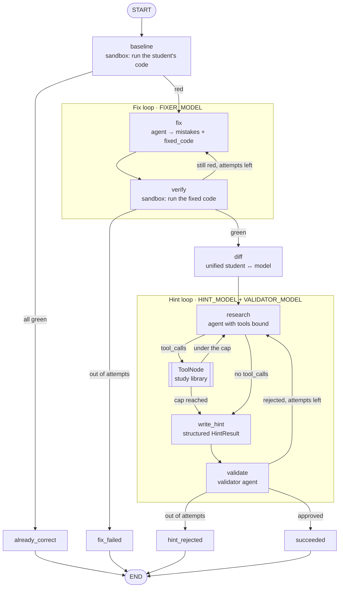
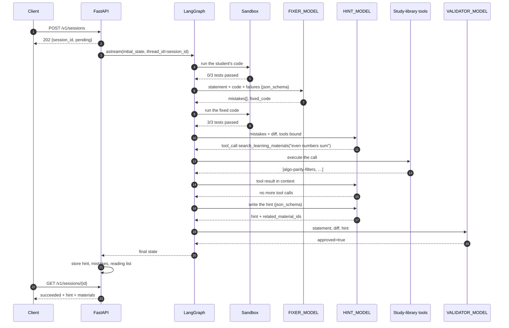

# problem-helper

An agent service: it takes a problem statement, a student's broken Python code and tests
(`stdin → stdout`), and returns a **hint** rather than a ready solution.

The repaired code and the diff stay inside the service — the agents need them so the hint
aims at the real mistake, and they are exposed only through the debug endpoint.

The pipeline is a **LangGraph** state machine driven by **LangChain** models and tools:
three agent roles (fixer, hint writer, validator) sit on the nodes, the hint writer can
call the study-library tools on its own, and every superstep is checkpointed, so a session
that dies mid-flight resumes instead of paying the provider twice.

## Setup

```bash
cp .env.example .env      # put your LLM_API_KEY in
uv sync
uv run problem-helper     # http://127.0.0.1:8000
```

Any OpenAI-compatible provider works (`LLM_BASE_URL`, OpenRouter by default). The three
model roles are configured separately; the fixer and the validator should be models that
support **structured outputs** (`response_format=json_schema`), because that is the first
thing the client tries. A model that rejects it is not a problem — the schema moves into
the prompt and the choice is remembered for that model id — but a model that supports it
gives far fewer retries. The hint model additionally needs **tool calling**.

```bash
uv run pytest             # 64 tests, the provider is replaced by a fake
uvx ruff check src tests  # ruff is not a project dependency
```

Smoke run against a real provider:

```bash
DB_PATH=/tmp/x.db PORT=8079 uv run problem-helper
# then POST /v1/sessions and poll GET /v1/sessions/{id}
```

## How it works

```
POST /v1/sessions ──► session row (pending) ──► asyncio task ──► LangGraph run
                                                                  │
                       1. run the student's code in the sandbox (baseline)
                          └─ everything green → outcome=already_correct, done
                       2. FIX LOOP (FIXER_MODEL), up to MAX_FIX_ATTEMPTS:
                          agent → {mistakes[], fixed_code} → run the tests
                          └─ still red at the end → failed / fix_failed
                       3. unified diff (student's code ↔ model's code)
                       4. HINT LOOP, up to MAX_HINT_ATTEMPTS:
                          HINT_MODEL researches with the tools, writes the hint →
                          VALIDATOR_MODEL judges it
                          (accuracy / explicitness / no spoiler / language)
                          └─ rejected → regenerate with the remarks in context
                          └─ rejected to the end → failed / hint_rejected
                       5. succeeded: hint, mistake list and reading list stored
```

Every iteration of both loops is appended to the `attempts` table, so you can see what the
model proposed, which tools it called and why the validator killed a hint.

The prompts are written in English, and each agent is told to produce its student-facing
text in the language of the problem statement — a Russian task yields a Russian hint.

### Agent graph



`research → tools → research` is the only edge the LLM controls: the model receives the
tool schemas and the graph follows whatever it asks for. Everything else is deterministic
routing on the state.

### Sequence: hint with a tool call (the usual case)



### Sequence: rejected hint, then a resume after a crash

```mermaid
sequenceDiagram
    autonumber
    participant C as Client
    participant API as FastAPI
    participant G as LangGraph
    participant CP as Checkpointer (SQLite)
    participant H as HINT_MODEL
    participant V as VALIDATOR_MODEL

    G->>H: write the hint
    H-->>G: "check your logic"
    G->>V: judge it
    V-->>G: approved=false, issues=["too vague"]
    G->>CP: checkpoint (hint_round=1, rejected=[…])
    Note over G: the conversation is dropped;<br/>the retry starts from a clean context<br/>with the remarks as text
    G->>H: write the hint again
    H--xG: provider is down
    API->>API: status=failed, error=internal_error

    C->>API: POST /v1/sessions/{id}/resume
    API->>G: astream(None, thread_id=session_id)
    G->>CP: load the last checkpoint
    CP-->>G: baseline, fixed_code, diff, hint_round=1
    Note over G: the fix loop is not replayed
    G->>H: write the hint again
    H-->>G: a concrete hint
    G->>V: judge it
    V-->>G: approved=true
    API-->>C: succeeded
```

## Tools

The hint agent has the study library the student learns from bound to it as LangChain
tools. It decides on its own whether to reach for them: a mistake that maps to a technique
gets the matching material, a typo gets none. What it actually pulled comes back with the
hint as a reading list (`result.materials`) and is visible in `GET /v1/tools` and the debug
endpoint.

| Tool | Arguments | What it does |
|---|---|---|
| `search_learning_materials` | `query`, `limit` (1–5) | Keyword search over the library; returns id, title, topic, level, tags and a one-line summary of the best matches. |
| `get_learning_material` | `material_id` | The full note behind an id, including the list of typical pitfalls; explains itself and lists the known ids when the id is unknown. |
| `list_material_topics` | — | Every topic in the library with the material ids under it; used to browse when a keyword search comes back empty. |

The library itself lives in `materials.py` — ten short notes on two pointers, sliding
window, binary search, prefix sums, counting with a dict, parity filters, loop bounds,
stdin parsing, sorting keys and complexity estimation. It is a plain list on purpose: the
MVP has no content service behind it, and `search`/`get` are the only entry points, so
swapping it for a real client later touches neither the tools nor the graph.

## Checkpointing

Every superstep of the graph is written to a LangGraph SQLite checkpointer
(`CHECKPOINT_DB_PATH`) under `thread_id = session_id`. A session that crashed — provider
outage, restart, a sandbox that died — is picked up with:

```bash
curl -X POST localhost:8000/v1/sessions/<id>/resume
```

The run continues from the last completed node: an already repaired solution is not
repaired again, and only the failed step and what follows it cost tokens. Resuming a
session that already succeeded is refused with `409`.

## API

### `POST /v1/sessions` → `202`

```json
{
  "task": "Given N integers, print the sum of the even ones.",
  "code": "n = int(input())\n...",
  "tests": [
    {"input": "5\n1 2 3 4 5\n", "expected_output": "6"}
  ],
  "max_fix_attempts": 3,
  "max_hint_attempts": 3
}
```

Response: `{"session_id": "...", "status": "pending"}`. Processing runs in the background.

### `GET /v1/sessions/{id}` — what may be shown to the student

```json
{
  "session_id": "...",
  "status": "succeeded",
  "stage": "done",
  "result": {
    "outcome": "hint_ready",
    "hint": "On line 5 the condition `nums[i] % 2 == 1` selects odd numbers...",
    "mistakes": [{"title": "...", "detail": "...", "line": 5}],
    "materials": [
      {
        "id": "algo-parity-filters",
        "title": "Filtering by parity and other predicates",
        "topic": "basics",
        "summary": "`x % 2 == 0` selects even numbers..."
      }
    ],
    "tests_total": 3,
    "tests_passed_before": 0
  },
  "error": null
}
```

`status`: `pending → running → succeeded | failed`, `stage`: `queued → running_tests →
fixing → hinting → done`.

`error.code`: `fix_failed` (no working solution in N attempts), `hint_rejected` (the
validator never approved a hint), `internal_error`.

### `POST /v1/sessions/{id}/resume` → `202`

Continues an unfinished session from its checkpoint. `404` when the session is unknown,
`409` when it already succeeded.

### `GET /v1/sessions/{id}/debug` — for the teacher

The original request, `fixed_code`, the diff, test reports, the tool calls the hint agent
made and every attempt of both loops.

### `GET /v1/tools`

The tools registered with the framework, with their argument schemas.

## Web playground

`GET /` serves a single-file page (`src/problem_helper/static/index.html`, no build step,
no CDN, no auth) for driving the service by hand: statement, code, an editable list of
tests, the two attempt limits, live stage while polling, then the hint, the reading list
and the mistake list. "Show internals" pulls `/debug` and renders the diff, the model's
solution, the student's code against every test, the tool calls and each fix/hint attempt
with the validator's remarks. The page prefills a broken even-sum solution, so it is one
click to see the whole loop. The session id goes into the URL hash, so reloading
`/#<session_id>` reopens a session.

## Configuration

Everything via `.env` (see `.env.example`). The important knobs:

| Variable | Default | Meaning |
|---|---|---|
| `LLM_BASE_URL` | `https://openrouter.ai/api/v1` | Any OpenAI-compatible provider |
| `FIXER_MODEL` | `anthropic/claude-sonnet-4.5` | Mistake analysis and code repair |
| `HINT_MODEL` | `google/gemini-3.5-flash-lite` | Hint generation and the tool calls |
| `VALIDATOR_MODEL` | `google/gemini-3.5-flash` | Hint judge |
| `MAX_FIX_ATTEMPTS` / `MAX_HINT_ATTEMPTS` | 3 / 3 | Loop limits |
| `SANDBOX_TIMEOUT_SEC` / `SANDBOX_MEMORY_MB` | 5 / 256 | Code execution limits |
| `DB_PATH` | `problem_helper.db` | SQLite file with the sessions |
| `CHECKPOINT_DB_PATH` | `problem_helper_checkpoints.db` | SQLite file with the graph checkpoints |

## Sandbox

Student and model code run in a separate `python -I` process in its own process session:
temporary cwd, stripped env, `RLIMIT_AS/CPU/FSIZE/CORE`, kill on timeout (children
included), stdout/stderr truncation. There is no network ban and no namespace isolation —
in production `sandbox.run_tests` is swapped for a container run behind the same interface.

## Modules

| Module | Role |
|---|---|
| `graph` | The LangGraph pipeline: nodes, the two loops, the tool loop |
| `state` | `PipelineState` — the explicit state schema with its reducers |
| `tools` | The LangChain tools and the reading list they produce |
| `materials` | The study library behind the tools |
| `llm` | LangChain access to the provider: structured output and tool calling |
| `prompts` | The prompts of the three agent roles |
| `sandbox` | Execution of untrusted code |
| `orchestrator` | Streams the graph into the database and owns the session status |
| `db` | aiosqlite storage for sessions and attempts |
| `api` | FastAPI, the background task and the static page |

## MVP limitations

- one language — Python;
- SQLite, and background work lives in the same process (a restart needs `/resume` to pick
  unfinished sessions back up);
- no authentication and no rate limits;
- tests are `stdin → stdout` only;
- the study library is a static list in the repo, not a real content service.
