# Problem Helper — Flow

Visual companion to `CLAUDE.md` and `docs/plans/20260729-mvp-service.md`.
Everything here is derived from the code as it stands; the plan is still the source of truth
for *why*, this file is the map of *what runs when*.

---

## 1. System at a glance

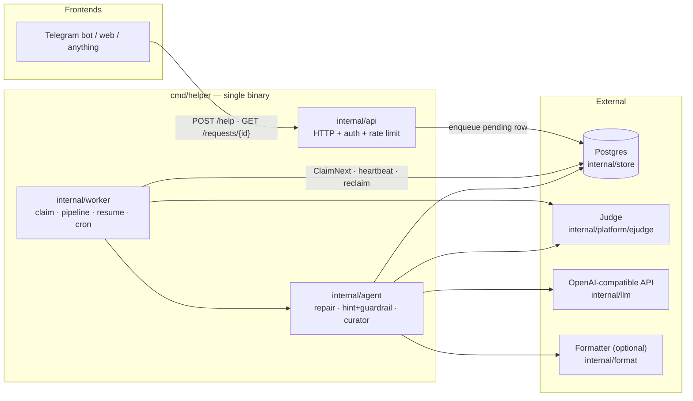

**Key property:** the API is fully synchronous only up to *enqueue*. Everything expensive
(platform scraping, two model loops, judge verification) happens in the worker, checkpointed
so a crash resumes instead of restarting.

---

## 2. Request lifecycle — steps 1–9

One `request_id`, end to end. Every step writes an `events` row; every model call writes an
`llm_calls` row; every completed step writes `help_requests.resume_step`.

```mermaid
flowchart TD
    START(["POST /help<br/>{user_id, problem_id, n_submissions?}"]) --> RL{"daily limit<br/>per user?"}
    RL -->|exceeded| R429["429"]
    RL -->|ok| ENQ["INSERT help_requests<br/>status=pending"]
    ENQ --> ACK(["202 → {request_id}"])

    ACK -.->|worker claims| S1

    S1["1 · ProblemStatus"] --> Q1{solved?}
    Q1 -->|yes| T1(["already_solved"])
    Q1 -->|no| S2["2 · ProblemStatement"]

    S2 --> S3["3 · Submissions → snapshot"]
    S3 --> Q3{"any usable?"}
    Q3 -->|no| T2(["no_submissions"])
    Q3 -->|yes| S4["4 · pick.Best<br/>max tests passed, tie → latest"]

    S4 --> S5["5 · SHIELD<br/>sanitize unicode → strip comments → diff"]
    S5 --> Q5{"language<br/>supported?"}
    Q5 -->|no| TF1(["failed<br/>unsupported language"])
    Q5 -->|yes| S6["6 · hint cache<br/>sha256(post-shield code) + problem_id"]

    S6 --> Q6{hit?}
    Q6 -->|yes| T3(["done — zero model calls"])
    Q6 -->|no| S7["7 · LOOP 1 — repair"]

    S7 --> Q7{verified fix?}
    Q7 -->|no| T4(["no_fix"])
    Q7 -->|yes| S8["8 · LOOP 2 — hint + guardrail"]

    S8 --> Q8{approved?}
    Q8 -->|no| T5(["no_hint"])
    Q8 -->|yes| S9["9 · InsertHint → SetHintID<br/>event hint_delivered"]
    S9 --> T6(["done"])

    style T1 fill:#3b3b1f,stroke:#8a8a3c
    style T2 fill:#3b3b1f,stroke:#8a8a3c
    style T3 fill:#1f3b28,stroke:#3c8a5a
    style T6 fill:#1f3b28,stroke:#3c8a5a
    style T4 fill:#3b2b1f,stroke:#8a5f3c
    style T5 fill:#3b2b1f,stroke:#8a5f3c
    style TF1 fill:#3b1f1f,stroke:#8a3c3c
```

### Checkpoints

| # | Step | `resume_step` | What must be readable back before the checkpoint |
|---|------|---------------|--------------------------------------------------|
| 1 | ProblemStatus | `status` | — (solved stops terminally) |
| 2 | ProblemStatement | `statement` | — (never persisted; re-fetched, and only while a later step still needs it) |
| 3 | Submissions + pick | `submissions` | `submissions` rows + `best_submission_id` |
| 5 | Shield | `shield` | `shield_records` row |
| 6 | Cache lookup | `cache` | — (a hit ends the request; a checkpoint means "missed") |
| 7 | Repair loop | `repair` | `repair_code` + `repair_run_id` |
| 8 | Hint loop | `hint` | `hints` row + `hint_id` |

> A checkpoint past a step whose output is **not** readable back is treated as a corrupt row
> (`infraFail`), never as a licence to re-run the step.

---

## 3. Status state machine

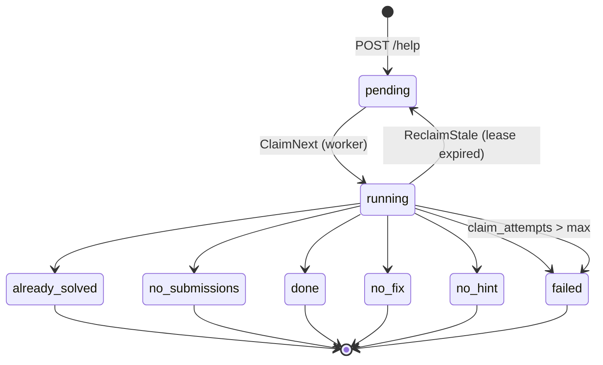

| Status | Meaning | Whose "fault" |
|--------|---------|---------------|
| `already_solved` | Student already passed the problem | Nothing to do |
| `no_submissions` | No usable attempt to work from | Nothing to do |
| `done` | Hint stored and delivered (fresh or cached) | Success |
| `no_fix` | Loop 1 gave up: `max_retries` / `cost_cap` / `no_baseline` / duplicate submit | **We chose to stop** |
| `no_hint` | Loop 2 gave up: `max_retries` / `cost_cap` / `stalled` / `guardrail_failed` | **We chose to stop** |
| `failed` | Our infrastructure broke (platform down, DB error, corrupt checkpoint) | **Us** |

That split is the whole point of the failure taxonomy: "the judge said no" and "our
infrastructure broke" must never collapse into one bucket — analytics and on-call both read it.

---

## 4. SHIELD (step 5)

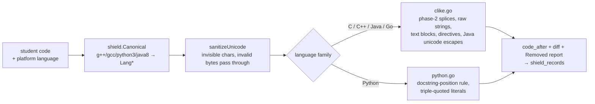

Order matters: **sanitize before stripping.** The comment scanners match raw bytes, so an
invisible character wedged into `/<U+200B>/ payload` is not a comment to them — it would fall
through as ordinary code with `Removed.Comments` empty.

---

## 5. LOOP 1 — repair (`internal/agent/repair`)

The model has no native tool-calling channel; the three "tools" are a discriminated `action`
field on one schema-validated response.

```mermaid
flowchart TD
    B["fetch baseline test cases<br/>from the student's failing run"] --> BQ{"baseline empty?"}
    BQ -->|yes| NB(["no_fix · no_baseline<br/>zero model calls"])
    BQ -->|no| PR{"PendingRunID<br/>on the row?"}

    PR -->|yes| POLL["poll that run — never resubmit<br/>the system login already paid for it"]
    PR -->|no| LOOP
    POLL --> LOOP

    LOOP{"cost cap? retries left?"} -->|exhausted| NF(["no_fix · cost_cap / max_retries"])
    LOOP -->|ok| ATT["attempt N: render prompt<br/>statement + shielded code + top-N mistakes<br/>+ previous code / prior abandon note"]

    ATT --> ACT{"model action"}
    ACT -->|list_test_results| TR["tail window of verdicts<br/>(acm scoring → failure is last)"] --> ACT
    ACT -->|get_test| GT["one test's input/correct/output"] --> ACT
    ACT -->|submit| FMTQ["optional formatter"]

    FMTQ --> GUARD["assertClaim — re-verify ownership<br/>immediately before the POST"]
    GUARD --> SUB["SubmitAsSystem<br/>under EJUDGE_SYSTEM_LOGIN"]
    SUB --> REC["persist run id + code<br/>the moment submit returns"]
    REC --> WAIT["poll until judged"]
    WAIT --> OKQ{"judge accepted<br/>AND baseline tests still pass?"}
    OKQ -->|yes| FIX(["fixed → code + run_id"])
    OKQ -->|no| RM["record raw_mistakes<br/>(feeds the nightly curator)"] --> LOOP

    style FIX fill:#1f3b28,stroke:#3c8a5a
    style NF fill:#3b2b1f,stroke:#8a5f3c
    style NB fill:#3b2b1f,stroke:#8a5f3c
```

**Verification is the judge's own accept verdict, not just the baseline tests.** `acm` scoring
halts at the first failure, so a student's failing run only has results up to that point — code
passing exactly those and failing a later test would otherwise ship as a "verified fix".

---

## 6. LOOP 2 — hint + guardrail (`internal/agent/hint`)

The hard part is *rejecting* hints, not writing them.

```mermaid
flowchart TD
    D["unified diff(original → working)<br/>the only view either agent gets"] --> L{"cost cap? retries left?"}
    L -->|exhausted| NH1(["no_hint · cost_cap / max_retries"])
    L -->|ok| WRITE["hint writer (agents.yaml: hint)"]

    WRITE --> CAP{"this attempt over<br/>max_cost_per_retry?"}
    CAP -->|yes| FB1["feed reason back as a user turn<br/>— never judged, so not marked seen"] --> L
    CAP -->|no| SEEN{"same hint<br/>proposed twice?"}
    SEEN -->|yes| NH2(["no_hint · stalled"])
    SEEN -->|no| RULES["deterministic rules.go<br/>leak fragments · looksExplicit<br/>zero tokens"]

    RULES -->|leak found| FB2["rejection → next user turn"] --> L
    RULES -->|clean| GR["guardrail model<br/>DIFFERENT family, enforced at startup"]

    GR --> V{"reply readable?"}
    V -->|prose / wrong schema / wrong types| NH3(["no_hint · guardrail_failed<br/>fail closed"])
    V -->|transport error / ctx cancelled| ERR(["not a verdict → stays reclaimable"])
    V -->|approved=false| FB3["reason → next user turn"] --> L
    V -->|approved=true| OK(["approved → store + deliver"])

    style OK fill:#1f3b28,stroke:#3c8a5a
    style NH1 fill:#3b2b1f,stroke:#8a5f3c
    style NH2 fill:#3b2b1f,stroke:#8a5f3c
    style NH3 fill:#3b2b1f,stroke:#8a5f3c
    style ERR fill:#3b1f1f,stroke:#8a3c3c
```

Three rules encoded here:

1. **Gate on the irreversible action** (delivering), not on writing.
2. **An interruption is not a verdict.** An unreadable *answer* is fail-closed; a dead
   connection is not an answer at all — the request stays reclaimable.
3. **Every retry path appends a turn before retrying.** `llm.Chat`'s own schema retry runs on a
   private copy of the conversation, so a bare `continue` resends a byte-identical message list
   and the model just repeats itself.

---

## 7. Queue: claim, heartbeat, reclaim

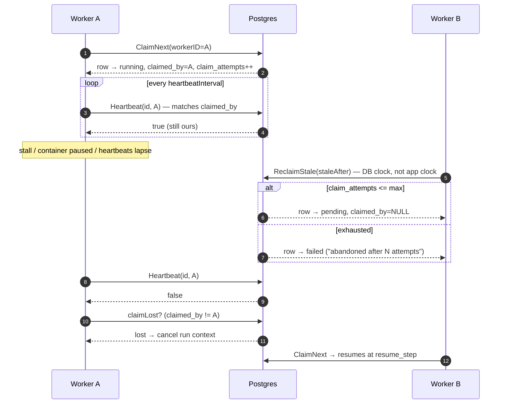

Every mid-run write is claim-scoped (`claimScopedUpdate`): `SetResumeStep`, `SetRepairResult`,
`SetBestSubmission`, `SetHintID`, `SetFailureReason`, `SetError`, plus `TransitionStatus`.
An **unclaimed** row is not writable either — that's exactly the post-reclaim, pre-claim window
where the stale worker is most likely still executing steps.

The one thing SQL can't fence is the judge submit, so loop 1 re-asserts the claim
(`assertClaim`) in the round trip immediately before `SubmitAsSystem`.

---

## 8. Metaloop — the curator (`internal/agent/curator`)

Off the critical path. Runs at startup and then on an interval (re-armed after each sweep, not
free-running), or on demand via `POST /admin/metaloop/run`.

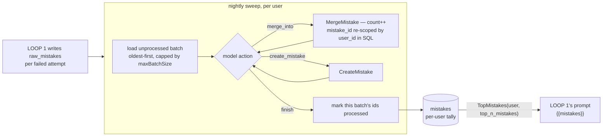

A sweep that **wrote anything** seals its batch even when it gives up or errors — merges commit
as they go, so leaving the batch open makes every later sweep re-merge and inflate
`mistakes.count` without bound. Only a sweep that wrote *nothing* leaves the batch for a retry.

Its budget is `one call per raw mistake + max_retries` — sizing it from `max_retries` alone made
any batch larger than the cap permanently unprocessable.

---

## 9. Data model

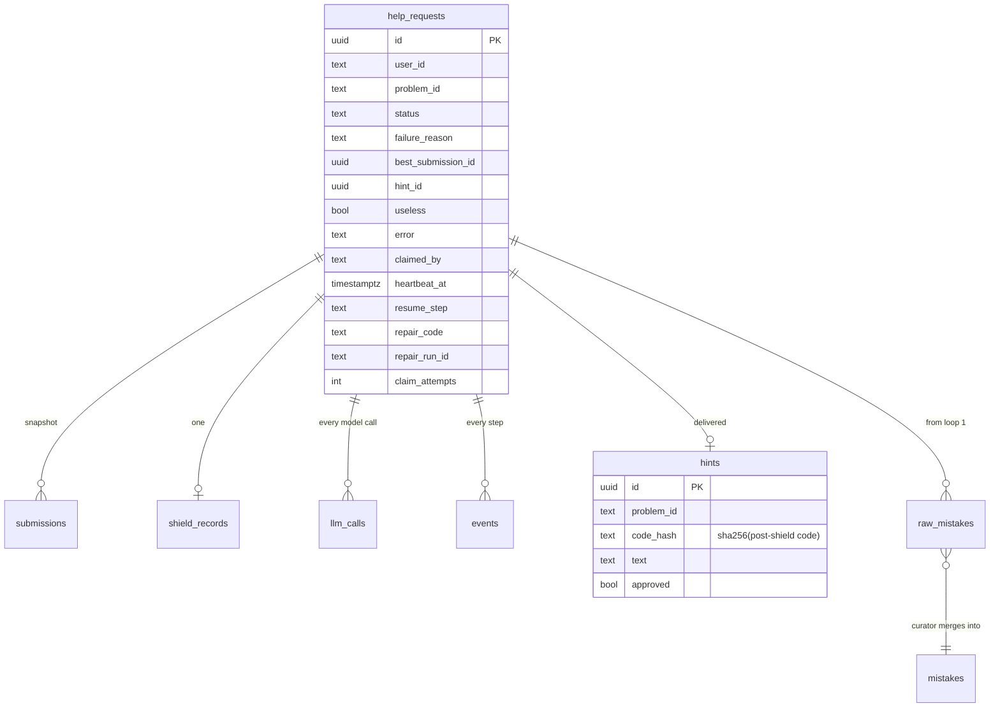

The hint cache is keyed on `(problem_id, code_hash)` and is deliberately **cross-user**: an
approved hint only carries diff + working code, never anything user-specific.

---

## 10. HTTP surface

| Method | Route | Auth | Notes |
|--------|-------|------|-------|
| `POST` | `/help` | `API_TOKEN` | Enqueues; rate-limited per user per day under an advisory lock |
| `GET` | `/requests/{id}` | `API_TOKEN` | `failed` returns a fixed message — `help_requests.error` can carry provider bodies and judge URLs |
| `GET` | `/admin/requests` | `ADMIN_TOKEN` | Filter by `useless` / `status` / `model`; full error text |
| `POST` | `/admin/requests/{id}/useless` | `ADMIN_TOKEN` | Effectiveness labelling |
| `POST` | `/admin/metaloop/run` | `ADMIN_TOKEN` | Detached context, extends its own write deadline |

Both tokens are compared with `subtle.ConstantTimeCompare`.

Analytics (`internal/store/analytics.go`) are **Go query functions, not endpoints**:
`CostByRequest`, `CostByModel`, `CostByAgent`, `RequestCountsByStatus`, `HintEffectivenessInputs`.

---

## 11. Where money is spent, and what bounds it

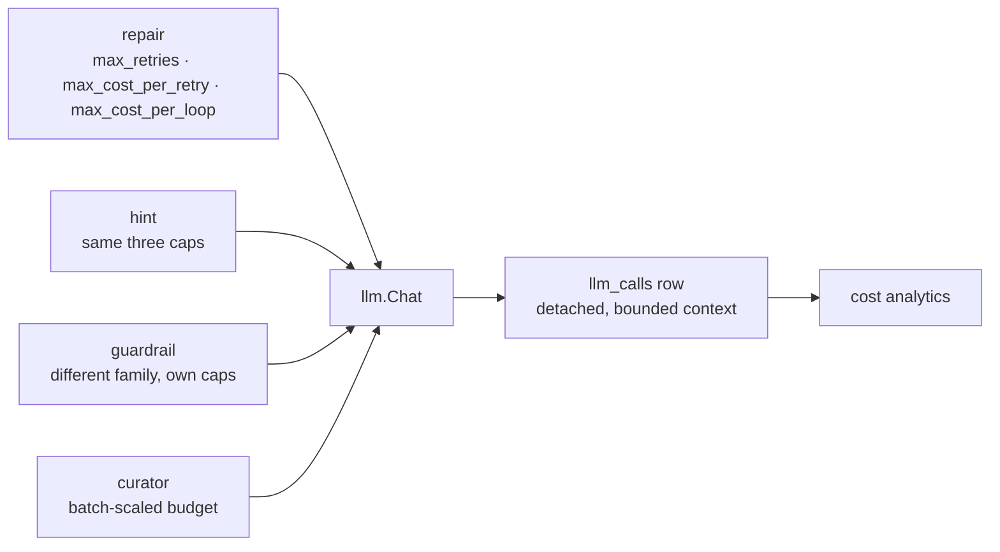

- `max_cost_per_loop` is checked **before each attempt**; `max_cost_per_retry` against **one
  attempt's** spend. Both can overshoot by at most one call — a call's cost is only known after
  it returns.
- What a cap is charged is what `llm.Chat` **spent**, not what its last HTTP call spent: a
  schema-rejected exchange billed two calls, and both count.
- **All three caps failing open is a startup error** (`validateCaps`), as is a `pricing` entry
  with a missing/zero `input`/`output`.
- Every `llm_calls` row is written on a detached, bounded context — by then the tokens are
  already paid for, so a dying `ctx` must not drop the record.

---

## 12. Configuration

| Source | Contents |
|--------|----------|
| Env (required) | `DATABASE_URL`, `LLM_BASE_URL`, `LLM_API_KEY`, `PLATFORM`, `API_TOKEN`, `ADMIN_TOKEN`, `EJUDGE_URL`, `EJUDGE_SYSTEM_LOGIN`, `EJUDGE_SYSTEM_PASSWORD` |
| Env (optional) | `EJUDGE_CONTEST_ID` (default `1`), `WORKER_CONCURRENCY` (default `1`) |
| `agents.yaml` | `defaults`, `repair`, `hint`, `guardrail`, `curator`, `pricing`, `formatter` |

`agents.yaml` is parsed with `KnownFields(true)`, every agent's `model` must have a `pricing`
entry, and the guardrail's model family must differ from the hint writer's — all checked at
startup, never at first traffic.

> `PLATFORM=mock` still requires the ejudge vars to be set. `newPlatform` is the only place that
> branches on `PLATFORM`, and mock mode uses `mock.NewDefaulting` so unscripted reads answer
> benignly instead of panicking.

---

## 13. Shutdown

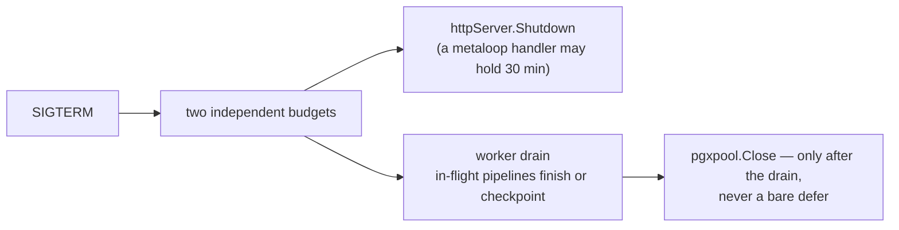

A single shared budget let HTTP shutdown eat all of it, abandoning every in-flight pipeline and
handing it straight back to the reclaim sweep — which re-spends both model budgets and
re-submits under the shared system login.

---

## 14. The one-paragraph version

A frontend enqueues `(user_id, problem_id)`. A worker claims the row, checks the student hasn't
already solved it, snapshots their submissions, picks the best failing one, strips everything
adversarial out of the code, and looks for a hint another student already earned for that exact
defect. On a miss it repairs the code and **proves the repair by running it on the real judge**,
then turns the diff — never the answer — into a hint that a guardrail model from a different
family must explicitly approve. Every step is checkpointed, every model call is priced and
logged, and every failed repair attempt feeds a nightly curator that builds a per-student
mistake profile which comes straight back into the next repair prompt.
